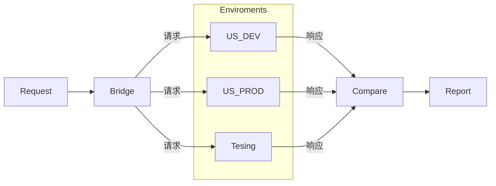
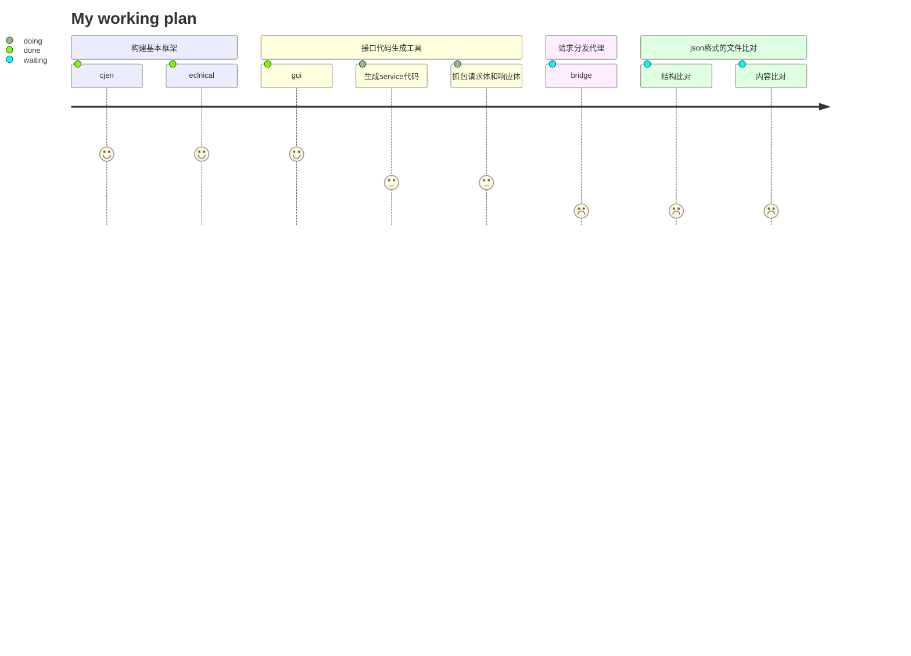

---
# try also 'default' to start simple
theme: seriph
# random image from a curated Unsplash collection by Anthony
# like them? see https://unsplash.com/collections/94734566/slidev
background: https://source.unsplash.com/collection/94734566/1920x1080
# apply any windi css classes to the current slide
class: 'text-center'
# https://sli.dev/custom/highlighters.html
highlighter: shiki
# show line numbers in code blocks
lineNumbers: false
drawings:
  persist: false
---

# 自动化工具分享

eclinical && cjen

<div class="pt-12">
  <span @click="$slidev.nav.next" class="px-2 py-1 rounded cursor-pointer" hover="bg-white bg-opacity-10">
    点击进入下页 <carbon:arrow-right class="inline"/>
  </span>
</div>

<div class="abs-br m-6 flex gap-2">
  <a href="https://github.com/thcpc/cjen" target="_blank" alt="GitHub"
    class="text-xl icon-btn opacity-50 !border-none !hover:text-white">
    <carbon-logo-github />cjen
  </a>
  <a href="https://github.com/thcpc/eclinical" target="_blank" alt="GitHub"
    class="text-xl icon-btn opacity-50 !border-none !hover:text-white">
    <carbon-logo-github />eclinical
  </a>
</div>

<!--
The last comment block of each slide will be treated as slide notes. It will be visible and editable in Presenter Mode along with the slide. [Read more in the docs](https://sli.dev/guide/syntax.html#notes)
-->

---

# 主题

eclinical && cjen 目标简化测试人员开发测试脚本的难度
- cjen 一些基础装饰器的封装
- eclinical  针对公司业务的封装
  
主要内容
-  **安装**
-  **Cli**
-  **Service**
-  **Meta**
-  **断言操作**
-  **使用演示**
-  **未来**


<br>
<br>


<style>
h1 {
  background-color: #2B90B6;
  background-image: linear-gradient(45deg, #4EC5D4 10%, #146b8c 20%);
  background-size: 100%;
  -webkit-background-clip: text;
  -moz-background-clip: text;
  -webkit-text-fill-color: transparent;
  -moz-text-fill-color: transparent;
}
</style>

---
layout: image-right
image: https://source.unsplash.com/collection/94734566/1920x1080
---

# 安装


```bash 
pip install eclinical
```


---
theme: seriph
layout: center
background: https://source.unsplash.com/collection/94734566/1920x1080
# apply any windi css classes to the current slide
class: 'text-center'
---

# Cli


<div class="pt-12">
  <span @click="$slidev.nav.next" class="px-2 py-1 rounded cursor-pointer" hover="bg-white bg-opacity-10">
    进入 <carbon:arrow-right class="inline"/>
  </span>
</div>

---

# Cli

创建工程的命令行工具

### 主要命令

|     |     |
| --- | --- |
| <kbd>edk</kbd> | 初始化整个整个工程，创建全局的配置文件 environment.yaml |
| <kbd>edk-module</kbd>  | 创建模块，需要在工程目录下执行 |
| <kbd>edk-service</kbd> | 创建service，需要在Module目录下执行 |
| <kbd>edk-meta</kbd> | 创建meta，需要在Module目录下执行 |


---

# Cli:edk

命令执行位置：任意文件夹中

```bash
# 初始化工程
edk -init

```
命令执行位置：Project 中
```bash {2|3|4|5|6|7|8|9|10|11|12|13|14|15|16}
# 添加新的 enviroment配置 到enviroment.yaml 文件
edk -new
请输入 enviroment 名
请输入访问的eclinical地址[1:113,2:97,3:115,4:38,5:us_dev,6:us_prod,7:us_demo4,8:shenkang_prod]
请输入登陆账号
请输入用户名密码, 如使用[Admin@123,请按回车]
加密公钥
请输入公司名, 如使用[非Cross账号,请按回车]
请输入申办方名
请输入实验名, 如使用[ctms, pv, etmf,请按回车]
请输入项目阶段[1:dev,2:uat,3:prod]
请输入数据库主机
请输入登陆账号
请输入数据库密码
请输入访问数据库的schema
请输入访问端口号, 如使用[3306,请按回车]
```

```bash
# 添加新的 enviroment配置,但是不配置数据库 到enviroment.yaml 文件
edk -new -no_db
```

<style>
.footnotes-sep {
  @apply mt-20 opacity-10;
}
.footnotes {
  @apply text-sm opacity-75;
}
.footnote-backref {
  display: none;
}
</style>


---

# Cli:edk-module

命令执行位置：Project 中

```bash
# 初始化一个module
edk-module -init

```
```bash {3|4|5|6}
# 新生成一个module
edk-module -init
请输入模块名
# 如果选择testcase 则文件夹会以testcase后缀为名，如果是helper 则以helper后缀为名
请输入Module类型[1:testcase,2:helper]
```

```bash {3|4|5|6}
# 新生成一个module, 同时创建service
edk-module -init -ns
请输入模块名
# 如果选择testcase 则文件夹会以testcase后缀为名，如果是helper 则以helper后缀为名
请输入Module类型[1:testcase,2:helper]
# 生成的 py 文件会已service结尾
请输入你想创建的service,命名方式'xx_yy'多个Service以','分割
xxx是什么系统[1:portaladmin,2:portal,3:ctms,4:etmf,5:design,6:edc,7:iwrs,8:eConsent(暂时不支持),9:pv,10:IDP(暂不支持),11:非Application]
```

<style>
.footnotes-sep {
  @apply mt-20 opacity-10;
}
.footnotes {
  @apply text-sm opacity-75;
}
.footnote-backref {
  display: none;
}
</style>


---

# Cli:edk-service

命令执行位置：Module 中

```bash
# 生成一个service
edk-service

```
```bash {2|3}
# 添加新的 enviroment配置 到enviroment.yaml 文件
edk -new
# 生成的 py 文件会已service结尾
请输入Service名 例如xx_yy
xxx是什么系统[1:portaladmin,2:portal,3:ctms,4:etmf,5:design,6:edc,7:iwrs,8:eConsent(暂时不支持),9:pv,10:IDP(暂不支持),11:非Application]
```

<style>
.footnotes-sep {
  @apply mt-20 opacity-10;
}
.footnotes {
  @apply text-sm opacity-75;
}
.footnote-backref {
  display: none;
}
</style>


---

# Cli:edk-meta

命令执行位置：Module 中

```bash
# 生成数据对象
edk-meta

```
```bash {2|3|4|5|6}
# 添加新的 enviroment配置 到enviroment.yaml 文件
edk-meta
请输入meta名 例如xx_yy
请输入meta的类型[1:Mysql,2:Json]
请输入该meta对象属于的service[1:不属于任何service,2:gggg_service,3:user_service]
```


<style>
.footnotes-sep {
  @apply mt-20 opacity-10;
}
.footnotes {
  @apply text-sm opacity-75;
}
.footnote-backref {
  display: none;
}
</style>


---
theme: seriph
layout: center
background: https://source.unsplash.com/collection/94734566/1920x1080
# apply any windi css classes to the current slide
class: 'text-center'
---

# Service


<div class="pt-12">
  <span @click="$slidev.nav.next" class="px-2 py-1 rounded cursor-pointer" hover="bg-white bg-opacity-10">
    进入 <carbon:arrow-right class="inline"/>
  </span>
</div>

---
class: px-20
---

# Service

主要的操作文件

```py
import cjen

from cjen import DatabasePool
from eclinical import PortalLoginService, Environment

# 继承于某个系统
class ExampleService(PortalLoginService):
    
    # __init__ 函数中的内容模板生成，主要获取配置与数据库链接
    # 不需要数据库需注释self.context['cursor']
    def __init__(self, environment: Environment):
        super().__init__(environment)
        self.context['cursor'] = DatabasePool.cursor(host=environment.db.get("host"), user=environment.db.get("user"), pwd=environment.db.get("pwd"), port=environment.db.get("port"), database=environment.db.get("database"))

    # 自定义方法，可发送http 请求,访问数据库
    def method(self):...

```


[获取更多的信息](https://github.com/thcpc/cjen#432-http-%E8%A3%85%E9%A5%B0%E5%99%A8) 

---
class: px-20
---

# Service: HTTP 操作

装饰器一共有5个，分别对应GET, POST, PUT，DELETE，文件上传

<div grid="~ cols-2 gap-2" m="-t-2">

```python
---
# 上传文件
@cjen.http.upload_mapping(uri="接口Path")
def method(self, data, resp=None, **kwargs): ...
---
```

```python
---
# POST请求
@cjen.http.post_mapping(uri="接口Path",json_class=User)
def method(self, data, user:User, resp=None, **kwargs): ...
---
```
```python
---
# GET请求
@cjen.http.get_mapping(uri="接口Path")
def method(self,path_variable, resp=None, **kwargs): ...
---
```

```python
---
# PUT请求
@cjen.http.put_mapping(uri="接口Path")
def method(self, data, resp=None, **kwargs): ...
---
```

```python
---
# DELETE请求
@cjen.http.delete_mapping(uri="接口Path")
def method(self, data, resp=None, **kwargs): ...
---
```


[获取更多的信息](https://github.com/thcpc/cjen#432-http-%E8%A3%85%E9%A5%B0%E5%99%A8) 

</div>
---
class: px-20
---

# Service: HTTP 操作 参数说明

参数命名为固定
| 参数  | 含义  |
| --- | --- |
| <kbd>data</kbd> | 用于请求体为json 或者 formData(上传文件) |
| <kbd>path_variable</kbd>  | 接口路径中带有参数,例如: /api/user/{id} |
| <kbd>resp</kbd> | resp=None 固定写法 |
| <kbd>**kwargs</kbd> | 固定写法 |
| <kbd>instance:class</kbd>| http 请求或数据库返回封装成meta 对象|
---
class: px-20
---

# Service: 查询数据库

最简单的例子

```python
@cjen.operate.mysql.factory(size=-1, clazz=Company, sql="SELECT * FROM company")
def get_many_companies(self, companies: list[Company], **kwargs):
    assert len(companies) == 5

```


---
class: px-20
---

# Service: 查询数据库-参数为字典

```sql
SELECT e.id as id, e.name as name, c.name as company
FROM employees as e
LEFT JOIN company as c
on e.company_id = c.id
WHERE e.id = %(id)s;
```

```python
@cjen.operate.mysql.factory(clazz=Employee, 
                            sql=FileHelper.cur_read(cur=__file__, file="employee.sql"), 
                            params=dict(id=1))
def get_e01_employee(self, employee: Employee, **kwargs):
  assert employee.name() == "E01"
  assert employee.company() == "C01"

```


---
class: px-20
---

# Service: 查询数据库-参数为列表


```sql
SELECT e.id as id, e.name as name, c.name as company 
FROM employees as e LEFT JOIN company as c on e.company_id = c.id 
WHERE e.id IN (%s, %s);
```

```python
@cjen.operate.mysql.factory(clazz=Employee, 
                            sql=FileHelper.cur_read(cur=__file__, file="employees.sql"),
                            params=[2, 3], size=-1)
def get_e0203_employee(self, employees: list[Employee], **kwargs):
  assert employees[0].name() == 'E02'
  assert employees[1].name() == 'E03'
```


---
class: px-20
---

# Service: 查询数据库-参数为上下问参数

```sql
SELECT e.id as id, e.name as name, c.name as company
FROM company as c
LEFT JOIN employees as e
on c.id = e.company_id
WHERE c.id=%(id)s;
```

```python
@cjen.operate.mysql.factory(clazz=Employee,
                            sql=FileHelper.cur_read(cur=__file__, file="employees_of_company.sql"),
                            params=ContextArgs(id="company_id"), size=-1)
def get_c01_employees(self, employees: list[Employee], **kwargs):
    assert len(employees) == 7
    for employee in employees: assert employee.company() == "C01"


def set_company_id(self): 
    self.context["company_id"] = 1

```


---
theme: seriph
layout: center
background: https://source.unsplash.com/collection/94734566/1920x1080
# apply any windi css classes to the current slide
class: 'text-center'
---

# Meta


<div class="pt-12">
  <span @click="$slidev.nav.next" class="px-2 py-1 rounded cursor-pointer" hover="bg-white bg-opacity-10">
    进入 <carbon:arrow-right class="inline"/>
  </span>
</div>

---
class: px-20
---

# Meta: 定义

Meta有2种，JSON, MySQL

<div grid="~ cols-2 gap-2" m="-t-2">

```python
---
# MetaJson 
class JsonObject(MetaJson):
    
    # 返回值装饰器
    @cjen.operate.common.value
    # 取值装饰器
    @cjen.operate.json.one(json_path="请填写jsonpath")
    def id(self): ...
---
```

```python
---
# MetaMysql
class MysqlObject(MetaMysql):

    # 返回值装饰器
    @cjen.operate.common.value
    def id(self): ...
---
```

</div>

---
class: px-20
---

# Meta: 生成MetaMysql


@cjen.operate.mysql.factory(clazz=Employee, sql=FileHelper.read(os.path.dirname(__file__), "employees.sql"), params=(4, 5), size=-1)

| 参数 | 必填 | 说明 |
| --- | --- | -- |
|  clazz | * | Meta实例的class |
|  sql | * | sql 语句 |
|  params | | 查询参数|
| size | | 返回所有的为-1 ，只返回第一个可不填 |


---
class: px-20
---

# Meta: 生成MetaJson

## 方式一:工厂方法
@cjen.operate.json.factory(clazz=C01Employees)

| 参数 | 必填 | 说明 |
| --- | --- | -- |
|  clazz | * | Meta实例的class |


## 方式二: 在Http请求中制定json_class
@cjen.http.post_mapping(uri="company/{company_id}", json_clazz=Company)
| 参数 | 必填 | 说明 |
| --- | --- | -- |
|  json_clazz |  | Meta实例的class |
---
theme: seriph
layout: center
background: https://source.unsplash.com/collection/94734566/1920x1080
# apply any windi css classes to the current slide
class: 'text-center'
---

# 断言


<div class="pt-12">
  <span @click="$slidev.nav.next" class="px-2 py-1 rounded cursor-pointer" hover="bg-white bg-opacity-10">
    进入 <carbon:arrow-right class="inline"/>
  </span>
</div>

---
class: px-20
---

# 断言: 常用装饰器

## Meta装饰器


| 装饰器 | 作用 |  
| --- | --- | 
| @cjen.operate.asserts.equal	 | 等于 |
| @cjen.operate.asserts.not_equal	 |  不等于 |
| @cjen.operate.asserts.in_range	 | 在范围内 |
| @cjen.operate.asserts.not_in_range	 | 不在范围内 |
| @cjen.operate.asserts.required	 | 必填 |


---
class: px-20
---

# 断言: 装饰器使用范例

```py
class CompanyC01(MetaMysql):

    @cjen.operate.common.value
    @cjen.operate.asserts.not_equal(value=1)
    @cjen.operate.asserts.required # 必填
    def id(self): ...

    @cjen.operate.common.value
    @cjen.operate.asserts.equal(value="C01") # 相等
    @cjen.operate.asserts.in_range(ranges=["C01", "C02", "C03", "C04"]) # 在范围值内
    def name(self): ...

class Employee(MetaMysql):
    @cjen.operate.common.value
    def id(self): ...

    @cjen.operate.common.value
    @cjen.operate.asserts.not_in_range(ranges=["C01", "C02", "C03", "C04"]) # 不在范围值内
    def name(self): ...


```
---
class: px-20
---

# 断言: 断言触发装饰器

## 指定meta中某个属性的断言检查触发

cjen.operate.asserts.validation_meta(meta_name="company", fields="id;name")


## 代码范例
```py
class AssertMockService(BigTangerine):

    @cjen.http.base_url(uri="http://127.0.0.1:5000")
    def __init__(self): super().__init__()


    @cjen.http.get_mapping(uri="none_field_response")
    @cjen.operate.mysql.factory(cursor=cursor(), clazz=CompanyC01,
                                sql="SELECT * FROM company WHERE id = 1",
                                params=dict(id=1))
    @cjen.operate.json.factory(clazz=ResponseNone)
    @cjen.operate.asserts.validation_meta(meta_name="company", fields="id;name") #  检查指定的fields,
    def validation_appoint(self, resp=None, company: CompanyC01 = None, resp_null: ResponseNone = None, **kwargs): ...
```
---
class: px-20
---

# 断言: 断言触发装饰器


## 触发meta中所有的属性的断言触发

cjen.operate.asserts.validation_meta(meta_name="resp_null") 


## 代码范例
```py
class AssertMockService(BigTangerine):

    @cjen.http.base_url(uri="http://127.0.0.1:5000")
    def __init__(self): super().__init__()


    @cjen.http.get_mapping(uri="none_field_response")
    @cjen.operate.mysql.factory(cursor=cursor(), clazz=CompanyC01,
                                sql="SELECT * FROM company WHERE id = 1",
                                params=dict(id=1))
    @cjen.operate.json.factory(clazz=ResponseNone)
    @cjen.operate.asserts.validation_meta(meta_name="resp_null") # 检查所有的fields
    def validation_appoint(self, resp=None, company: CompanyC01 = None, resp_null: ResponseNone = None, **kwargs): ...
```
---
class: px-20
---

# 断言: 自定义校验


## 代码范例
```py
class AssertMockService(BigTangerine):

    @cjen.http.base_url(uri="http://127.0.0.1:5000")
    def __init__(self): super().__init__()


    @cjen.http.get_mapping(uri="none_field_response")
    @cjen.operate.mysql.factory(cursor=cursor(), clazz=CompanyC01,
                                sql="SELECT * FROM company WHERE id = 1",
                                params=dict(id=1))
    @cjen.operate.json.factory(clazz=ResponseNone)
    def validation_appoint(self, resp=None, company: CompanyC01 = None, resp_null: ResponseNone = None, **kwargs):
      assert company.id() == 1
```
---
theme: seriph
layout: center
background: https://source.unsplash.com/collection/94734566/1920x1080
# apply any windi css classes to the current slide
class: 'text-center'
---

# 未来


<div class="pt-12">
  <span @click="$slidev.nav.next" class="px-2 py-1 rounded cursor-pointer" hover="bg-white bg-opacity-10">
    进入 <carbon:arrow-right class="inline"/>
  </span>
</div>

---
class: px-20
---

# 未来: 已知问题

- 调试信息不方便，日志方面有待优化
- 针对metaMysql 获取一个对象的时候，有时候取值有问题
- 针对并发，链接数据库时，可能会把数据库连接消耗完
    
---
class: px-20
---

# 未来: 待改进

- 调试信息不方便，日志方面有待优化
- 针对metaMysql 获取一个对象的时候，有时候取值有问题
- 针对并发，链接数据库时，可能会把数据库连接消耗完
    
---
---
# 未来: 目标




---
layout: center
class: text-center
---

# 谢谢！


